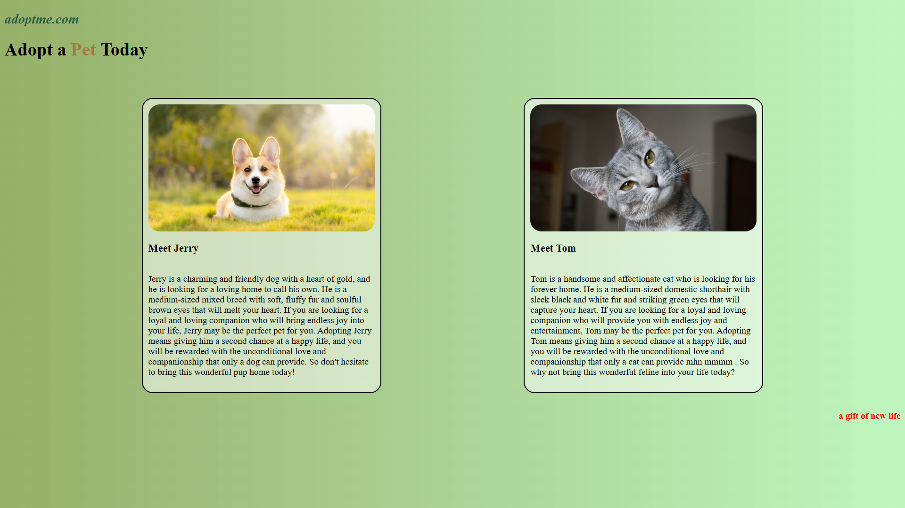

# Pet Adoption Website

## Project Overview
A simple pet adoption website created to practice CSS Flexbox layout and card design using pure vanilla CSS (no frameworks or libraries).

## Features
- Responsive design with Flexbox layout
- Interactive pet cards with hover effects
- Mobile-friendly layout (media queries for screens ≤375px)
- Clean, semantic HTML structure
- Pure vanilla CSS styling

## Technologies Used
- HTML5
- CSS3 (Flexbox, media queries, transitions)
- No JavaScript used

## Key CSS Techniques Practiced
- Flexbox layout (`display: flex`, `justify-content`, `flex-wrap`)
- Card component styling with borders and rounded corners
- Hover effects with smooth transitions
- Responsive design with media queries
- Text styling and color schemes

## File Structure
PetAdoption
├── PetAdoption.html # Main HTML file
├── Petstyle.css # CSS stylesheet
├── dog.jpg # Dog image (Jerry)
├── cat.jpg # Cat image (Tom)
