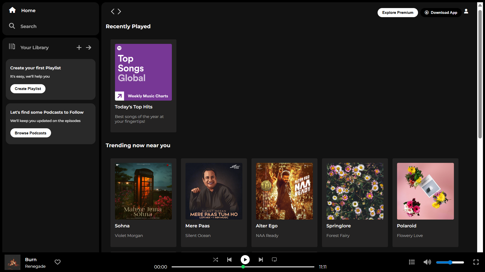

# 🎵 Spotify Clone – Frontend Practice Project

This project is an **exact clone of the Spotify Web Player UI**, built only for **practicing frontend development skills**.  
It replicates the layout, structure, and look of Spotify’s interface using **HTML** and **CSS**.  

⚠️ **Disclaimer:** This is a non-commercial practice project. I have taken some **creative liberties**.

---

## ✨ Key Features

- Complete **Spotify Web Player UI clone**  
- Sidebar with **Home, Search, and Your Library**  
- Playlist & Podcast library placeholders  
- Content sections:
  - Recently Played  
  - Trending Now Near You  
  - Featured Charts  
- Sticky **Music Player Bar** with:
  - Album art & song info  
  - Play/Pause/Next/Previous controls  
  - Progress bar with timer  
  - Volume controls  
- **Responsive design** with media queries  

---

## 🖼️ Screenshot

  

---

## 🛠️ Technologies Used

- **HTML5**
- **CSS3**
  - Flexbox Layout  
  - Media Queries  
  - Custom Card Styling  
  - CSS Range Inputs (progress & volume sliders)  
- **Font Awesome** for substituted icons  
- **Google Fonts (Montserrat)** for typography  

---

## 💻 Key CSS Techniques Practiced

- Sidebar + main content split with **flexbox**  
- Sticky navigation & footer music bar  
- Card-based responsive layout  
- Styled sliders for progress and volume control  
- Hover effects & clean typography  

---

## 📁 Files Included

- `index.html` – HTML structure of the Spotify clone  
- `styles.css` – Styling and responsiveness  
- `assets/` – Images, logos, and icons  

---

## 🧠 Personal Challenges

- Recreating the **sticky bottom music player** and ensuring it stayed responsive across screen sizes.  
- Aligning the **middle section (albums & playlists)** was tricky because the images had different dimensions. I had to adjust the styling to maintain a consistent card layout.  
- Since Spotify uses **custom-made icons and fonts**, I had to substitute them with **Font Awesome icons** and **Google Fonts (Montserrat)** while keeping the layout as close as possible to the original.  

---

### 🔗 Live Link
http://spotify-practice-clone.netlify.app/

---

## 🙋‍♀️ Author

[]shambhavikothiwal.2003@gmal.com  
  
  

---
